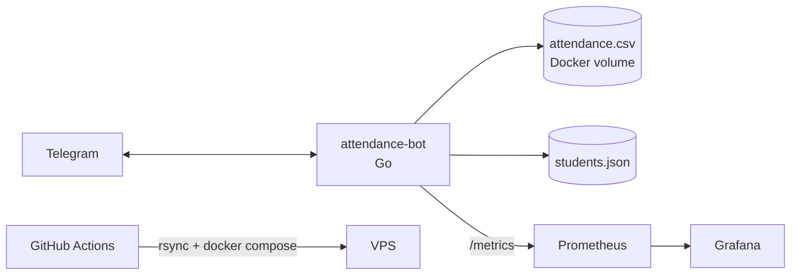

<div align="center">

# 📋 Attendance Bot

**Telegram-бот для учёта посещаемости учебной группы**


[Возможности](#-возможности) •
[Архитектура](#-архитектура) •
[Быстрый старт](#-быстрый-старт) •
[Деплой](#-деплой-cicd) •
[Мониторинг](#-мониторинг) •
[Roadmap](#-roadmap)

</div>

---

## ✨ Возможности

- ✅ **Отметка явки** одной командой `/checkin`
- 📊 **Отчёт в виде таблицы** прямо в чате
- 📁 **Выгрузка в Excel** (`.xlsx`) для старосты и преподавателя
- ⏰ **Напоминания** в групповой чат по будням в 07:00 (МСК)
- 📈 **Метрики Prometheus** и дашборды Grafana
- 🐳 **Запуск в Docker**, автодеплой через GitHub Actions

## 🤖 Команды

| Команда         | Описание                          |
| --------------- | --------------------------------- |
| `/start`        | Приветствие и список команд       |
| `/checkin`      | Отметить своё присутствие         |
| `/report_table` | Отчёт по посещаемости в чате      |
| `/report_excel` | Отчёт в виде Excel-файла          |

## 🏗 Архитектура



### Структура проекта

```
attendance-bot/
├── main.go              # инициализация и обработка обновлений
├── reminder.go          # планировщик напоминаний
├── handlers/            # start, attendance, report, excel
├── storage/             # students.json, запись явок в CSV
├── config/              # конфигурация
├── excel/               # генерация .xlsx
├── metrics/             # метрики Prometheus
├── data/students.json   # список студентов
├── Dockerfile
├── docker-compose.yml
└── prometheus.yml
```

## 🚀 Быстрый старт

### Требования

- Go 1.26+
- Docker и Docker Compose
- Токен бота от [@BotFather](https://t.me/BotFather)

### Локальный запуск

```bash
git clone https://github.com/mindcapp/attendance-bot.git
cd attendance-bot/attendance-bot

echo "TELEGRAM_BOT_TOKEN=<токен_от_BotFather>" > .env

go run .
```

### Запуск в Docker

```bash
docker compose up -d --build
docker compose logs attendance-bot --tail=20
```

### Переменные окружения

| Переменная           | Обязательна | Описание                                                        |
| -------------------- | :---------: | --------------------------------------------------------------- |
| `TELEGRAM_BOT_TOKEN` |     да      | Токен бота                                                      |
| `REMINDER_CHAT_ID`   |     нет     | ID группового чата для напоминаний. Если не задан, они отключены |
| `ATTENDANCE_FILE`    |     нет     | Путь к CSV-файлу с явками                                       |
| `TZ`                 |     нет     | Часовой пояс контейнера (`Europe/Moscow`)                       |

> ⚠️ Файл `.env` содержит секреты и **не должен попадать в git**. Он добавлен в `.gitignore`.

## 📦 Деплой (CI/CD)

При каждом push в `main` GitHub Actions:

1. собирает Docker-образ (проверка, что код компилируется);
2. копирует проект на VPS через `rsync`;
3. записывает `.env` из секрета и перезапускает контейнеры через `docker compose`.

### GitHub Secrets

| Секрет               | Значение                          |
| -------------------- | --------------------------------- |
| `VPS_HOST`           | IP-адрес сервера                  |
| `VPS_USER`           | Пользователь для SSH              |
| `VPS_SSH_KEY`        | Приватный SSH-ключ                |
| `TELEGRAM_BOT_TOKEN` | Только токен, без префикса `KEY=` |

## 📈 Мониторинг

| Сервис     | Порт   |
| ---------- | ------ |
| Prometheus | `9091` |
| Grafana    | `3000` |

Доступные метрики:

| Метрика                    | Описание                                                      |
| -------------------------- | ------------------------------------------------------------- |
| `commands_total`           | Количество вызовов команд (`start`, `checkin`, `report_*`)    |
| `errors_total`             | Количество ошибок по типам                                    |
| `users_seen`               | Уникальные пользователи                                       |
| `request_duration_seconds` | Время обработки запросов                                      |

## 🗺 Roadmap

- [x] Отметка явки и отчёты (таблица, Excel)
- [x] Docker, Prometheus, Grafana
- [x] CI/CD через GitHub Actions
- [x] Напоминания по расписанию
- [ ] Rate limiting для `/checkin`
- [ ] Подтверждение явки inline-кнопками
- [ ] Хранилище на PostgreSQL вместо CSV
- [ ] REST API
- [ ] Админ-команды для старосты
- [ ] Kafka для асинхронной обработки явок

## 🛠 Стек

**Go** · `go-telegram-bot-api/v5` · **Docker Compose** · **Prometheus** · **Grafana** · **GitHub Actions**

## 👤 Автор

**mindcapp** — [GitHub](https://github.com/mindcapp)

---

<div align="center">

made for SPBSTU /w love <3🎓

</div>
